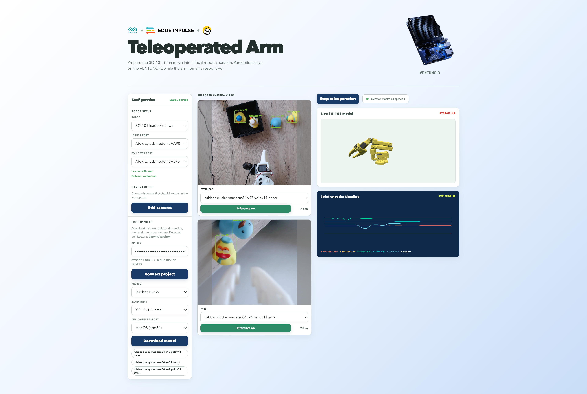

# LeRobot + Edge Impulse Demo

A local-first booth application for an SO-101 leader/follower arm pair running on an Arduino VENTUNO Q or a standard Linux computer.

The app combines:

- SO-101 leader-to-follower teleoperation through LeRobot
- Guided setup for serial ports and saved cameras
- Live camera previews with persistent names and selections
- A real SO-101 URDF viewer using LeLab's model assets
- Live joint telemetry and a six-joint encoder timeline
- Edge Impulse model downloads filtered by the host architecture
- A per-camera Edge Impulse model selection with an inference toggle
- Arduino, Edge Impulse, and LeRobot/LeLab logo lockup in the web app header
- A left configuration rail for robot, camera, and Edge Impulse settings
- Read-only leader/follower calibration readiness status



## Quick Start

Install the hardware-enabled tool from a Git repository:

```bash
uv tool install 'lerobot-ei-demo[hardware] @ git+https://github.com/luisomoreau/lerobot-so101-ei.git'
lerobot-ei-demo
```

The `[hardware]` extra installs the pinned LeRobot v0.6.0 Feetech runtime for SO-101 control and the Edge Impulse Linux inference runtime. It intentionally does not install LeRobot's training or command-line script extras, which pull in unrelated native dependencies such as `evdev`. This demo uses image inference and does not require the SDK's optional PyAudio audio support. The base install only includes the web application server and is intended for development or environments without connected hardware.

On the VENTUNO Q, select uv's CPU-only PyTorch backend so the Qualcomm MPU does not download NVIDIA CUDA packages. Edge Impulse `.eim` deployments remain the app's accelerated inference path; PyTorch is used by the LeRobot control stack and does not target the VENTUNO Q NPU:

```bash
UV_NO_SOURCES=1 \
UV_INDEX_URL=https://download.pytorch.org/whl/cpu \
UV_EXTRA_INDEX_URL=https://pypi.org/simple \
UV_INDEX_STRATEGY=unsafe-best-match \
uv tool install 'lerobot-ei-demo[hardware] @ git+https://github.com/luisomoreau/lerobot-so101-ei.git'
```

For a checkout during development:

```bash
uv sync --extra hardware --extra dev --native-tls
uv run lerobot-ei-demo --port 8000
```

On the VENTUNO Q, use the CPU backend while syncing the development environment:

```bash
UV_NO_SOURCES=1 \
UV_INDEX_URL=https://download.pytorch.org/whl/cpu \
UV_EXTRA_INDEX_URL=https://pypi.org/simple \
UV_INDEX_STRATEGY=unsafe-best-match \
uv sync --extra hardware --extra dev --native-tls
```

Open the printed local URL. If port 8000 is already in use, choose another one:

```bash
uv run lerobot-ei-demo --port 8001
```

The `--native-tls` option may be needed on managed machines whose Python certificate store does not trust package indexes.

By default, the server listens on all network interfaces (`0.0.0.0`), which allows another computer on the same LAN to reach the app. On the VENTUNO Q, find its IP address with `hostname -I` or `ip addr`, then open `http://<VENTUNO_Q_IP>:8000` from the other computer. You can bind to a specific interface when needed:

```bash
uv run lerobot-ei-demo --host 0.0.0.0 --port 8000
```

The VENTUNO Q and client device must be on the same network, and any device firewall must allow inbound TCP traffic on the selected port. Binding to `0.0.0.0` exposes the local control UI to that network, so use a trusted LAN or specify a restricted host/firewall rule.

## Hardware Setup

The application currently targets one SO-101 leader and one SO-101 follower.

1. Connect both arms by USB.
2. Confirm the ports with the included port finder:

   ```bash
   uv run lerobot-find-port
   ```

3. Ensure calibration files exist for both roles. The default LeRobot locations are under:

   ```text
   ~/.cache/huggingface/lerobot/calibration/
   ```

4. Start the app and verify the saved leader and follower ports in the setup controls.
5. Start teleoperation only after the follower workspace is clear and the operator has access to the physical emergency stop.

The app uses `connect(calibrate=False)` for normal startup so it never silently opens LeRobot's interactive calibration prompts. The configuration rail reports whether leader and follower calibration files are present. Fresh calibration still needs a dedicated guided flow before it should be enabled for booth use.

### Add a new SO-101 pair

Use this procedure when replacing or adding a fresh leader/follower pair:

1. **Secure the hardware.** Put the follower in a clear workspace, keep the emergency stop accessible, and leave both arms unpowered until the USB connections are ready. Treat the arm connected as the leader and the arm connected as the follower consistently throughout setup.
2. **Connect one arm at a time.** Connect the leader by USB and run:

  ```bash
  uv run lerobot-find-port
  ```

  Record the port reported after disconnecting and reconnecting that arm. Repeat for the follower. On the VENTUNO Q, ports normally look like `/dev/ttyACM0` or `/dev/ttyUSB0`; on macOS, they normally look like `/dev/cu.usbmodem...` or `/dev/cu.usbserial...`.
3. **Prepare the calibration environment.** The booth package intentionally omits LeRobot's `core_scripts` extra because it pulls in keyboard and native `evdev` dependencies. The recommended setup is a separate Python 3.12 virtual environment, following LeRobot's official uv installation method. Calibrate the arms from your MacBook when possible, then copy the two JSON files to the VENTUNO Q:

  ```bash
  mkdir -p ~/lerobot-calibration
  cd ~/lerobot-calibration
  uv venv --python 3.12
  source .venv/bin/activate
  uv pip install 'lerobot[core_scripts,feetech]'
  ```

  On the VENTUNO Q, use the CPU PyTorch backend because it has a Qualcomm MPU rather than an NVIDIA GPU:

  ```bash
  uv pip install --torch-backend cpu 'lerobot[core_scripts,feetech]'
  ```

  If calibration must run directly on the VENTUNO Q, install its native build prerequisites first. The package name may be `python3.12-dev` or `python3-dev` depending on the installed Debian image:

  ```bash
  sudo apt update
  sudo apt install -y build-essential linux-libc-dev python3.12-dev
  ```

  If `python3.12-dev` is unavailable, use `python3-dev` or calibrate on the MacBook instead. The `Python.h` error from `evdev` means the selected Python interpreter does not have its development headers installed.
4. **Calibrate the follower first.** With the follower connected at its recorded port and the arm secured, run:

  ```bash
  lerobot-calibrate --robot.type=so101_follower --robot.port=/dev/ttyACM0 --robot.id=SO101
  ```

  Replace the port with the recorded follower port. Follow the interactive prompts, move only as instructed, and keep people and objects clear of the arm.
5. **Calibrate the leader.** Disconnect the follower, connect the leader at its recorded port, and run:

  ```bash
  lerobot-calibrate --teleop.type=so101_leader --teleop.port=/dev/ttyACM1 --teleop.id=SO101
  ```

  Replace the port with the recorded leader port. The calibration process disables torque and requires operator movement; never run it unattended.
6. **Verify the calibration files.** Both roles should have a `SO101.json` file under:

  ```text
  ~/.cache/huggingface/lerobot/calibration/robots/so_follower/SO101.json
  ~/.cache/huggingface/lerobot/calibration/teleoperators/so_leader/SO101.json
  ```

  On a VENTUNO Q, these files must be present on the VENTUNO Q itself. Copying only the application does not copy calibration data.
7. **Start the booth app and select the pair.** Start `lerobot-ei-demo`, choose the recorded leader and follower ports in **Robot setup**, and confirm both status indicators say **calibrated**. The app does not write the port files automatically; keep the recorded ports available if device enumeration changes after reboot.
8. **Test without motion first.** Confirm both ports and calibration indicators, clear the follower workspace, and make sure the emergency stop works. Press **Start teleoperation** only after these checks, then move the leader slowly and stop immediately if the follower behaves unexpectedly.

If either calibration status remains **needs calibration**, do not start teleoperation. Recheck the role, `SO101` ID, calibration path, and selected USB port.

## Cameras

The setup page detects OpenCV camera indices and allows additional indices to be entered manually.

1. Select **Set up cameras**.
2. Name each camera using a booth-friendly name such as `Overhead` or `Wrist`.
3. Select the cameras to use.
4. Save the configuration.

Only selected cameras appear as live streams in the main workspace. Unselected cameras are not streamed. All available cameras are previewed only while the **Add cameras** setup flow is open; those temporary previews close when setup is saved or closed. Saving explicitly signals unused camera streams to stop on the backend. Configuration is stored at:

```text
~/.cache/huggingface/lerobot-ei-demo/cameras.json
```

Each saved camera has an independent stream at `/api/cameras/{camera_id}/stream`.

## Edge Impulse Models

The configuration rail can build and download `.eim` models directly from Edge Impulse Studio.

The backend uses the versioned Studio API base URL `https://studio.edgeimpulse.com/v1`; project API requests therefore resolve under `/v1/api/...`.

1. Paste an Edge Impulse API key and select **Connect project**.
2. Choose the project, then choose the experiment/impulse to deploy. Projects with several experiments expose each one in the **Experiment** selector.
3. Targets that do not match the host operating system and CPU architecture are greyed out and cannot be selected.
4. Select **Download model**. The app starts a Studio build job for the selected experiment, polls it, then stores the executable `.eim` file.

Downloaded models are stored in the directory named by `EI_MODELS_DIR` (default `models/`). Model chips in the configuration rail show which files can run here; incompatible files are struck through.

Each selected camera view carries its own model selector and **Inference on/off** toggle button, so different streams can run different models. The latest per-camera inference time appears next to that button and is also available as `inference_ms` from `/api/inference/status`. When enabled, the official `edge-impulse-linux` runner classifies each live frame and the stream displays the latest inference time in milliseconds. For models using `fit-shortest` preprocessing, translucent grey bands mark the parts of the camera frame cropped out before inference. Object-detection boxes are drawn directly into the MJPEG stream; FOMO detections are converted to labeled centroid pointers, while other centroid-style detections are also drawn as labeled dots. Incompatible models are disabled in the selector, and the backend rejects enabling one with HTTP 409.

The detected architecture is reported by `GET /api/edge-impulse/architecture`. Compatibility is derived from the deployment target text and `.eim` filename: `aarch64` hosts also accept `armv7` builds, and x86 builds are never accepted on ARM.

The API key is stored by the backend in the demo root at `.edge_impulse_config.json` (or the path set by `LEROBOT_EI_CONFIG`) with `0600` file permissions. This file is ignored by git. The configuration rail loads the saved key when the app starts and saves it after connecting. Use a device configuration service instead for unattended booth deployments with centralized secret management.

## Development

Backend files live in `lerobot_ei_demo/`. The frontend is a React/Vite application in `lerobot_ei_demo/frontend/`.

Run frontend development mode:

```bash
npm --prefix lerobot_ei_demo/frontend install
npm --prefix lerobot_ei_demo/frontend run dev
```

The Vite development server proxies `/api` to `127.0.0.1:8000`. Build the production frontend before testing the bundled Python application:

```bash
npm --prefix lerobot_ei_demo/frontend run build
```

The Python server serves `frontend/dist/` when it exists and falls back to the source entrypoint otherwise.

The header uses locally bundled Arduino, Edge Impulse, LeRobot/LeLab, and VENTUNO Q image assets under `frontend/public/assets/`. The VENTUNO Q product image is presented as a large borderless header visual, and the live SO-101 model card uses a compact viewport so the robot and controls remain visible together. Branding does not require external requests at runtime.

The web app uses a full-width three-column workspace on desktop with a white-to-blue diagonal page background: configuration on the left, selected camera streams in a narrower middle column, and the teleoperation control, live URDF, and joint telemetry on the right. Camera feeds keep their normal preview geometry. The teleoperation control sits directly above the robot view. Primary controls use navy blue. Robot ports, on-demand camera previews/names/selections, and the Edge Impulse project/target/download controls live in the configuration rail. Camera previews open only after selecting **Add cameras**. The Edge Impulse API key field is masked and is never written to browser storage. Per-camera inference runs in the backend and annotates each selected stream independently.

## Testing

```bash
uv run --no-sync ruff check lerobot_ei_demo tests
uv run --no-sync ruff format --check lerobot_ei_demo tests
uv run --no-sync pytest -q
npm --prefix lerobot_ei_demo/frontend run build
```

Hardware tests should be performed deliberately with the arms secured. Unit tests do not move hardware.

## Architecture

```text
React/Vite
  setup, saved camera views, URDF viewer, encoder timeline
          | HTTP + WebSocket + MJPEG
          v
FastAPI
  RobotSession   LeRobotController   TelemetryHub   CameraRegistry
          |             |                  |
          +--> SO-101 serial arms    joint-data WebSocket
    +--> OpenCV cameras

  ModelCatalog   InferenceService   DownloadManager
    +--> Edge Impulse Studio API (build + download .eim)
```

Edge Impulse routes:

```text
GET  /api/models
GET  /api/edge-impulse/architecture
GET  /api/edge-impulse/config
PUT  /api/edge-impulse/config       { api_key, project_id }
POST /api/edge-impulse/projects       { api_key }
POST /api/edge-impulse/targets        { api_key, project_id }
POST /api/edge-impulse/download       { api_key, project_id, impulse_id, deployment_type, ... }
GET  /api/edge-impulse/download/{job_id}
GET  /api/inference/status
POST /api/inference/assign            { camera_id, model_id, enabled, confidence }
POST /api/inference/stop              ?camera_id=
```

The telemetry stream publishes normalized joint names:

```json
{
  "type": "joint_update",
  "timestamp": 123.45,
  "joints": {
    "shoulder_pan": 0.0,
    "shoulder_lift": -20.0,
    "elbow_flex": 45.0,
    "wrist_flex": 10.0,
    "wrist_roll": 0.0,
    "gripper": 20.0
  }
}
```

LeRobot observations arrive as keys such as `shoulder_pan.pos`; `TelemetryHub` removes the `.pos` suffix before publishing. The current values are calibrated joint positions in degrees, not raw Feetech register counts.

The URDF viewer uses LeLab's `so101_new_calib.urdf` and binary mesh assets from its distribution tree. If the booth must run offline, mirror those assets into the package instead of relying on the CDN URL in the frontend.
The viewer automatically frames the full arm at a close initial zoom; users can still orbit and zoom the model interactively.

## Current Boundaries

- SO-101 is the only robot type implemented.
- Calibration is not yet exposed as a guided web workflow.
- Edge Impulse project connection, architecture-filtered model downloads, per-camera model assignment, and live `.eim` detection overlays are implemented. Classification-only models do not currently render a score panel; the overlay path is focused on bounding-box and centroid outputs.
- Teleoperation and telemetry are implemented; disconnect recovery and operator-facing fault states need further hardening.
- The encoder timeline currently shows calibrated positions. Raw encoder register telemetry should be added as a separate field if required.

## Safety

This application can move physical hardware. Before pressing **Start teleoperation**:

- Clear people and objects from the follower workspace.
- Use conservative operating limits.
- Keep a physical emergency stop available.
- Stop the application before changing USB connections.
- Never run an unreviewed control-loop change directly at a public booth.

## Related Work

- [LeLab](https://github.com/huggingface/leLab/): reference web interface and SO-101 URDF assets
- [LeRobot](https://github.com/huggingface/lerobot): robot control framework
- [Edge Impulse Linux Python SDK](https://docs.edgeimpulse.com/tools/libraries/sdks/inference/linux/python): image inference runtime
- [Arduino VENTUNO Q](https://www.arduino.cc/product-ventuno-q): target edge AI platform
